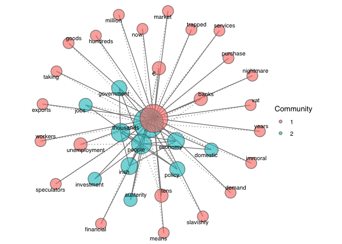

<!-- README.md is generated from README.Rmd. Please edit that file -->

# khcnet

## Example

This is a basic example which shows you how to solve a common problem:

``` r
library(khcnet)
library(quanteda)
#> Package version: 4.3.0
#> Unicode version: 14.0
#> ICU version: 71.1
#> Parallel computing: disabled
#> See https://quanteda.io for tutorials and examples.

corp <- quanteda::data_char_sampletext

dfm  <- quanteda::tokens(corp)|>
  tokens_remove(stopwords("en", source = "marimo"))|>
  dfm()

dfm_net <- dfm_select(dfm, names(topfeatures(dfm, 50))) 

res <- khcnet(
  dfm_net,
  edges = 80, 
  community = "fast_greedy", 
  bw_groups = FALSE,
  fill_alpha = 0.55,     
  font_family = "Noto Sans CJK JP",
  show_size_legend = TRUE,
  bubble_size = 100,
  label_colour = "black",
  label_repel = TRUE
)

res <- khcnet(dfm, edges = 80, community = "fast_greedy", fill_alpha = 0.6)
res$plot
```



## Citation

If you use `khcnet` in academic work, please cite:

Terashita, Kazuhiro (2025). *khcnet: KH Coder-style Co-occurrence
Network Visualization*. GitHub repository.
<https://github.com/namiterashita/khcnet>
